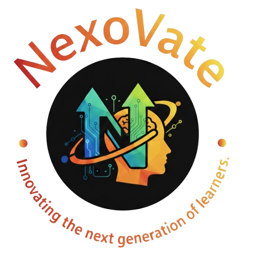

# 🎓 NexoVate - E-Learning Platform Frontend

A production-quality, fully responsive e-learning platform built with Next.js, Tailwind CSS.
This is a frontend-only implementation using mock data and localStorage for persistence.


<p align="center">
  
</p>

## 🔗 **Live Demo:** [NexoVate – E-Learning Platform](https://nexovate-e-learning.vercel.app/)

## ✨ Features

- 🏠 **Landing Page** – Hero section, featured courses, testimonials
- 📚 **Course Catalog** – Browse, search, filter, and sort courses
- 📖 **Course Detail** – Detailed course info with lesson list
- 🎥 **Lesson Player** – Embedded YouTube videos with progress tracking
- 🧑‍💻 **User Dashboard** – My courses, progress tracking, profile management
- 🔐 **Authentication** – Sign In / Sign Up with validation (frontend only)
- 👨‍🏫 **Instructor Wizard** – Multi-step course creation flow
- 🌙 **Dark Mode** – Full dark/light theme with localStorage persistence
- 📱 **Responsive Design** – Mobile-first layout for all screen sizes
- ♿ **Accessibility** – Semantic HTML, ARIA labels, keyboard navigation

## 🧰 Tech Stack
| 🧩 **Category**	| ⚙️ **Technology** |
|----------------|----------------|
| 🖥️ Framework | Next.js (Latest) with App Router |
| 💻 Language | JavaScript (JSX) |
| 🎨 Styling	| Tailwind CSS v4 with custom theme |
| 🧱 UI Components | shadcn/ui |
| 🪶 Icons | lucide-react |
| 📊 Data	Mock | JSON files + localStorage |
| 🎬 Video | YouTube embeds via iframe |

## Project Structure

```
├── app/
│   ├── layout.jsx 
│   ├── page.jsx 
│   ├── signin/
│   │   └── page.jsx 
│   ├── signup/
│   │   └── page.jsx
│   ├── courses/
│   │   ├── page.jsx 
│   │   └── [slug]/page.jsx
│   ├── dashboard/
│   │   └── page.jsx 
│   └── instructor/
│       └── create-course/
│           └── page.jsx
│
├── components/
│   ├── Navigation.jsx 
│   ├── Footer.jsx
│   ├── CourseCard.jsx
│   ├── CourseFilters.jsx 
│   ├── LessonPlayer.jsx 
│   ├── ReviewsSection.jsx
│   ├── EditProfileModal.jsx 
│   ├── OAuthButtons.jsx
│   └── Theme-Provider.jsx 
│
├── hooks/
│   ├── useAuth.js
│   ├── useCourses.js 
│   └── useTheme.js
│
├── lib/
│   ├── storage.js 
│   └── utils.js 
│
├── public/
│   └── mock-data/
│       ├── courses.json
│       └── users.json 
│
└── README.md   
```

## Getting Started

### Installation

```
# Clone the repository
git clone https://github.com/Itsme-Debapriya/NexoVate

# Navigate into the folder
cd NexoVate

# Install dependencies
npm install

# Start the development server
npm run dev
```

## License

This project is open source and available for educational purposes.
